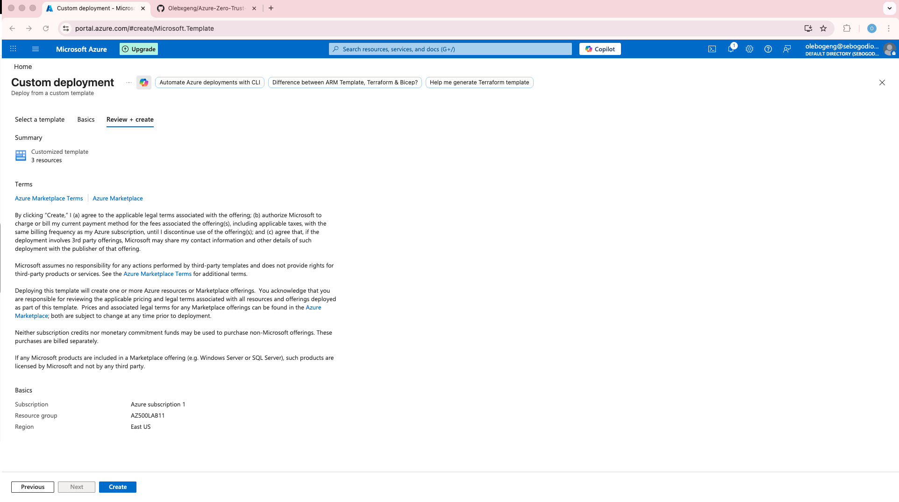
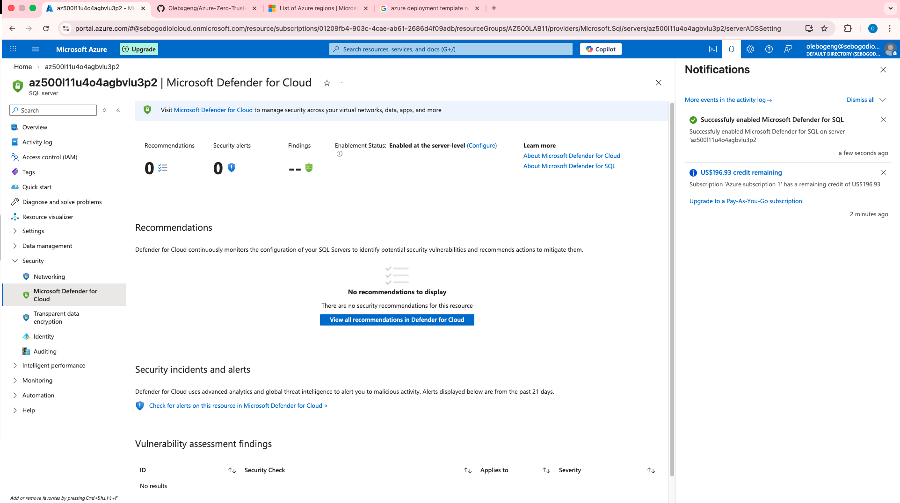
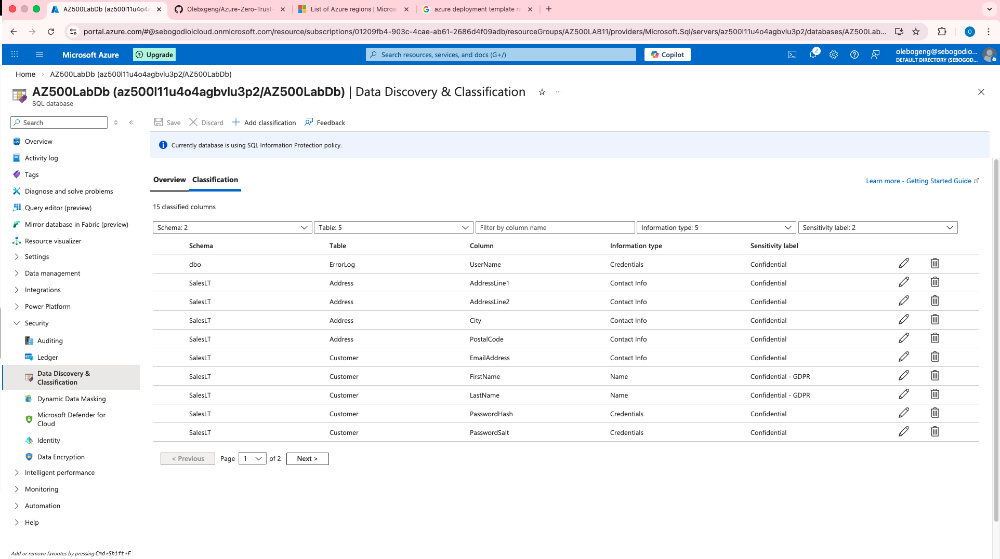
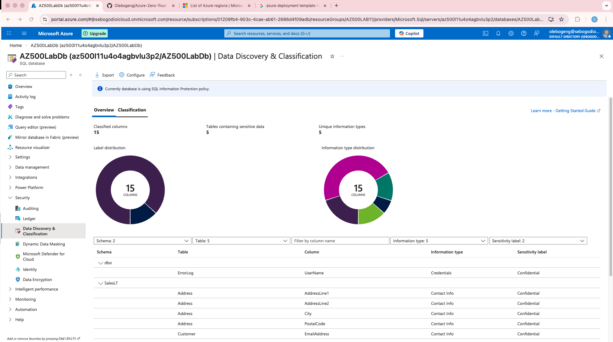
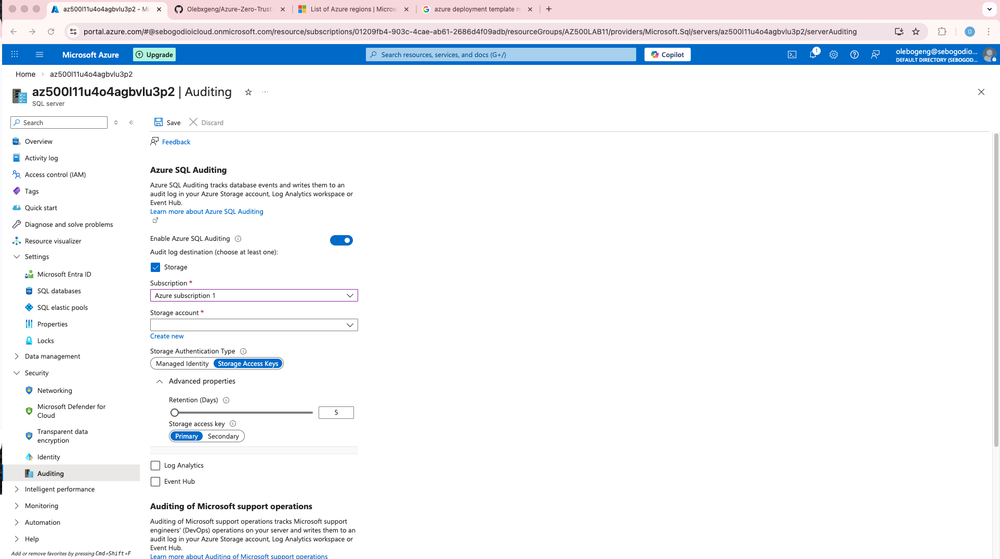
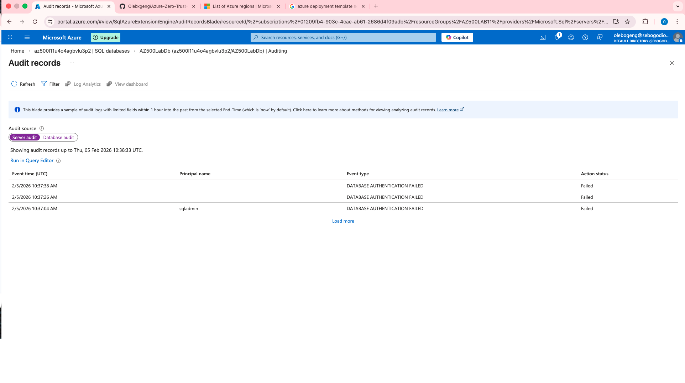

# 🛡️ AZ-500 Lab — Securing Azure SQL Database


> **Author:** Olebogeng Sebogodi
> **Lab:** Securing Azure SQL Database  
> **Region Used:** East US 2

---

## 📖 Table of Contents

- [Lab Overview](#-lab-overview)
- [Objectives](#-objectives)
- [Prerequisites](#-prerequisites)
- [Architecture Diagram](#-architecture-diagram)
- [Step-by-Step Implementation](#-step-by-step-implementation)
  - [Task 1 — Deploy Azure SQL Database](#task-1---deploy-azure-sql-database)
  - [Task 2 — Configure Advanced Data Protection](#task-2---configure-advanced-data-protection)
  - [Task 3 — Configure Data Classification](#task-3---configure-data-classification)
  - [Task 4 — Configure Auditing](#task-4---configure-auditing)
- [Validation](#-validation)
- [Cleanup](#-cleanup)
- [Audit & Security Outcomes](#-audit--security-outcomes)

---

## 🧠 Lab Overview

This lab was created to secure a Azure SQL Database by implementing advanced protection, data classification, and auditing to safeguard against SQL injection, data leakage, and support compliance requirements.

---

## 🎯 Objectives

By completing this lab, you will:

- Deploy an Azure SQL Database using an ARM template  
- Enable advanced security protections  
- Discover and classify sensitive data  
- Configure auditing on both server and database levels

---

## ✅ Prerequisites

Before beginning, ensure:

- [ ] You have an **Azure subscription**  
- [ ] You’re signed into the **Azure Portal**  
- [ ] Your account has **Owner** or **Contributor** permissions  
- [ ] Lab files are available (e.g., `azuredeploy.json`)

---

## 🧩 Architecture Diagram

> _High-level overview of the security controls implemented in this lab_


---

## 🛠️ Step-by-Step Implementation

### 📌 Task 1 — Deploy Azure SQL Database

1. Deploy a custom template → Build your own template in the editor.  
2. Upload ARM template & svae.  
3. Enter the following settings:
   - **Subscription**
   - **Resource group**
   - **Location**
4. Review + Create → Create and wait for deployment to complete

**Screenshot**


---

### 🔐 Task 2 — Configure Advanced Data Protection

1. Go to Resource groups → (resource created in previous step).  
2. Select the SQL Server created by the template.  
3. Security → Microsoft Defender for Cloud.  
4. Enable Microsoft Defender for SQL.  
5. Configure pricing/trial if required.

**Screenshots**


---

### 🧾 Task 3 — Configure Data Classification

1. SQL Server → SQL Databases.  
2. Select your database .  
3. Security → Data Discovery & Classification.  
4. Review recommended classifications.  
5. Select All → Accept Selected Recommendations → Save. 

**Screenshots**


---

### 📊 Task 4 — Configure Auditing

#### 🧪 Server Level
1. On the SQL Server blade → Auditing.  
2. Enable Azure SQL Auditing.  
3. Choose Storage and create a new storage account for logs.  
4. Set Retention (days) (e.g., 5).  
5. Click Save. 

#### 📁 Database Level
1. SQL Databases → Security → Auditing.  
2. Validate server auditing applies or adjust settings (Log Analytics/Event Hub).  
3. Optionally, use Query editor to generate log entries and review audit logs. 

**Screenshots**


---

## 🧪 Validation

- Confirm the database was created successfully.  
- Check that Defender for SQL is enabled.  
- Validate that data classification labels are applied.  
- Generate a query and verify auditing logs are being captured.

**Screenshots**


---


## 🔍 Audit & Security Outcomes

- Deployed a hardened Azure SQL environment
- Enabled threat protection with Microsoft Defender for SQL
- Classified sensitive data for compliance
- Configured auditing at server and database levels


---

## 🧹 Cleanup


To avoid unnecessary charges:

1. Open Azure Cloud Shell.  
2. Run:

```powershell
Remove-AzResourceGroup -Name "AZ500LAB11" -Force -AsJob
```
---

Created by: Olebogeng Sebogodi
GitHub: https://github.com/Olebxgeng

